# PES Version Control System Project

## Student Details
Name: Sindhu GV
SRN: PES2UG24CS661 

---

## Phase 1: Object Storage
- Implemented object_write and object_read
- Used SHA-256 hashing
- Stored objects in .pes/objects/

### Screenshots:
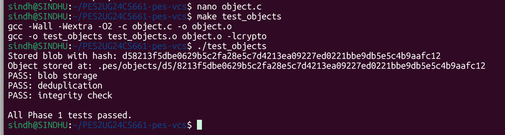
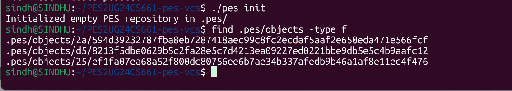

---

## Phase 2: Tree Objects
- Implemented tree_serialize
- Created directory structure
- Handled recursion

### Screenshot:
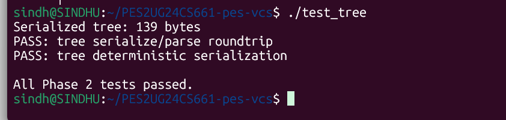
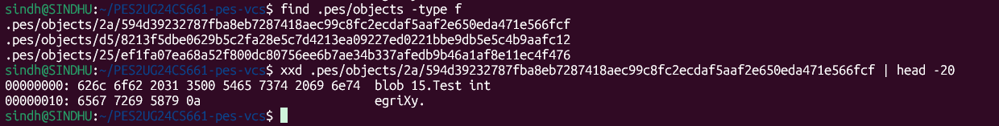

---

## Phase 3: Index (Staging)
- Implemented index_load, index_add, index_save
- Managed staging area

### Screenshot:
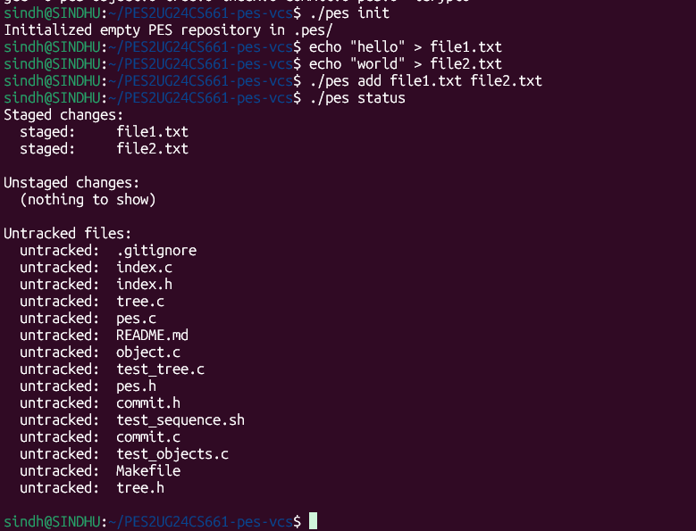
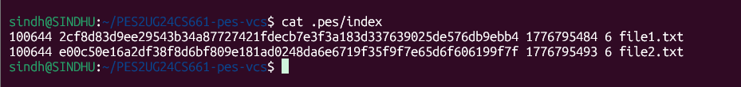

---

## Phase 4: Commit
- Implemented commit creation
- Linked tree and commits
- Verified using logs

### Screenshot:
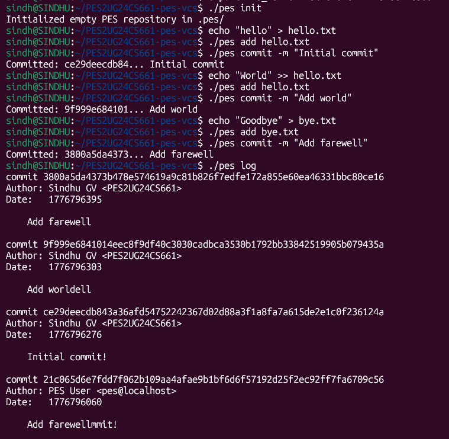
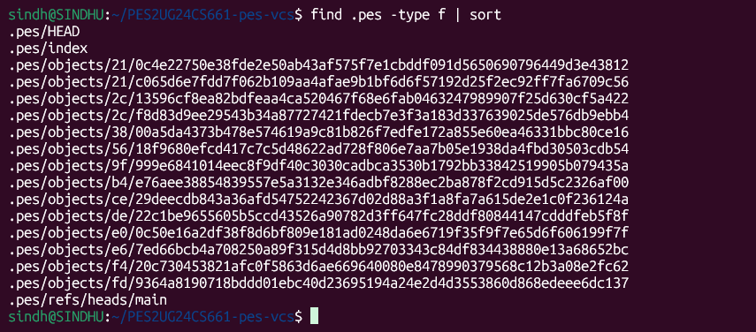
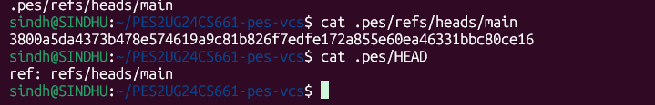

---
### Final

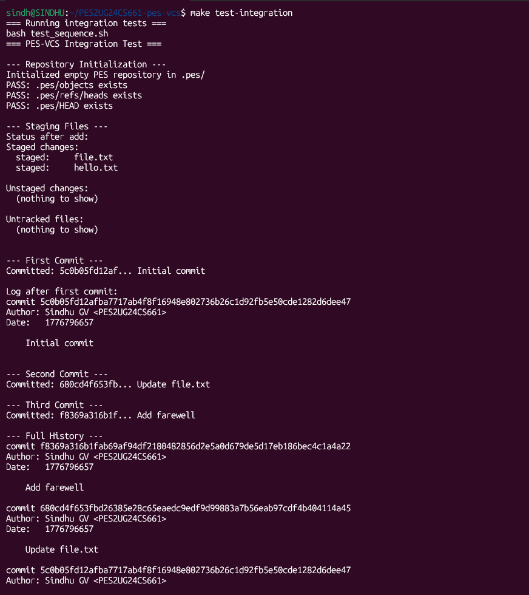
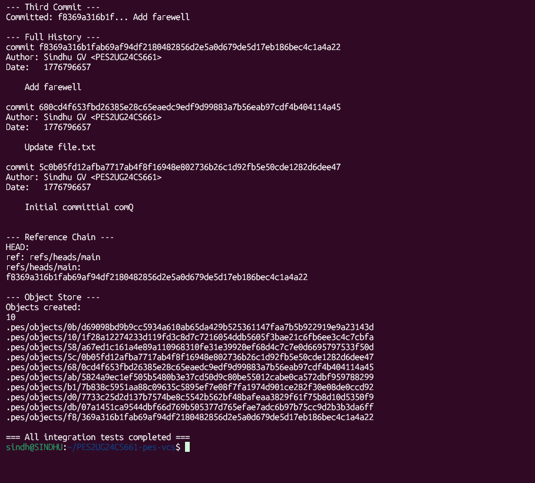

## Analysis Answers

###Branching and Checkout
###Q5.1: A branch in Git is just a file in .git/refs/heads/ containing a commit hash. Creating a branch is creating a file. Given this, how would you implement pes checkout <branch> — what files need to change in .pes/, and what must happen to the working directory? What makes this operation complex?
To implement pes checkout <branch>, three files in .pes/ must change. First, .pes/HEAD is updated to contain ref: refs/heads/<branch>. Second, the target branch's commit hash is read from .pes/refs/heads/<branch>. Third, the working directory is updated by traversing the target commit's tree and writing each file's blob content to disk. The operation is complex because the working directory may have uncommitted changes — if a file differs between branches and has local modifications, blindly overwriting it would destroy user work. A safe implementation must detect and refuse such conflicts before touching any file.

###Q5.2: When switching branches, the working directory must be updated to match the target branch's tree. If the user has uncommitted changes to a tracked file, and that file differs between branches, checkout must refuse. Describe how you would detect this "dirty working directory" conflict using only the index and the object store.
Detection works in two stages. First, compare each tracked file's current mtime and size against the stored index metadata — any mismatch signals a potential modification. If metadata differs, re-hash the working file and compare it to the blob hash in the index to confirm the change is real (not just a timestamp artifact). Second, compare the confirmed-modified file's index hash against the corresponding entry in the target branch's tree. If the hashes differ between the two, the file would be overwritten by checkout, so the operation must be refused with an error. Files that are identical in both branches can be safely ignored even if locally modified.

###Q5.3: "Detached HEAD" means HEAD contains a commit hash directly instead of a branch reference. What happens if you make commits in this state? How could a user recover those commits?
In detached HEAD state, .pes/HEAD contains a raw commit hash instead of a branch reference like ref: refs/heads/main. New commits still write correctly — head_update writes the new hash directly to HEAD. However, once HEAD is moved to a branch (e.g., pes checkout main), those detached commits have no reference pointing to them and become unreachable — invisible to pes log and eligible for garbage collection. Recovery is straightforward: create a new branch reference file manually at .pes/refs/heads/recovered containing the detached commit's hash, making it reachable agai
###Garbage Collection and Space Reclamation
###Q6.1: Over time, the object store accumulates unreachable objects — blobs, trees, or commits that no branch points to (directly or transitively). Describe an algorithm to find and delete these objects. What data structure would you use to track "reachable" hashes efficiently? For a repository with 100,000 commits and 50 branches, estimate how many objects you'd need to visit.

Use a mark-and-sweep approach. The mark phase starts from all references — every file in .pes/refs/heads/ plus the resolved value of .pes/HEAD — and does a full graph traversal: for each reachable commit, mark the commit object, recursively mark all tree objects it references, and mark every blob in those trees. Store marked hashes in a hash set for O(1) lookup. The sweep phase then enumerates every file under .pes/objects/ and deletes any whose hash is not in the set. For a repository with 100,000 commits across 50 branches, assuming an average of 10 blobs and 3 tree objects per commit, you would visit roughly 1.4 million objects in the mark phase.

###Q6.2: Why is it dangerous to run garbage collection concurrently with a commit operation? Describe a race condition where GC could delete an object that a concurrent commit is about to reference. How does Git's real GC avoid this?
Use a mark-and-sweep approach. The mark phase starts from all references — every file in .pes/refs/heads/ plus the resolved value of .pes/HEAD — and does a full graph traversal: for each reachable commit, mark the commit object, recursively mark all tree objects it references, and mark every blob in those trees. Store marked hashes in a hash set for O(1) lookup. The sweep phase then enumerates every file under .pes/objects/ and deletes any whose hash is not in the set. For a repository with 100,000 commits across 50 branches, assuming an average of 10 blobs and 3 tree objects per commit, you would visit roughly 1.4 million objects in the mark phase.assuming an average of 10 blobs and 3 tree objects per commit, you would visit roughly 1.4 million objects in the mark phase.
